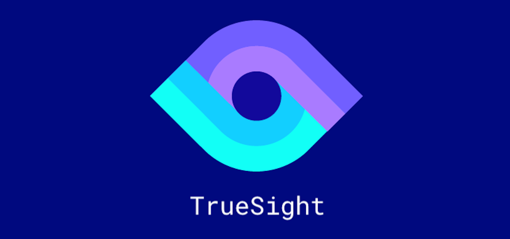

# TrueSight



TrueSight, in a nutshell, is the potential solution to providing assistance to the visually impaired in a world of complex ambient activities and interactions. Our framework leverages the power of Deep Learning in Computer Vision to analyse events around the user and generate feedback in the form of audio, so as to keep the user as aware as possible. The project is by no means a replacement for vision, but aims towards being a complement to the stronger senses of the person.

## Current Features

* <b>Scene Classification</b>
* <b>Real-Time Object Detection</b>
* <b>Scene Captioning</b>
* <b>Text Recognition</b>
* <b>Text to Speech</b>

## Getting Started

Set up the environment by running the following command inside the `TrueSight` directory:
```
python install -r requirements.txt
```
Once complete, run the script `app.py` like:
```
python app.py
```

